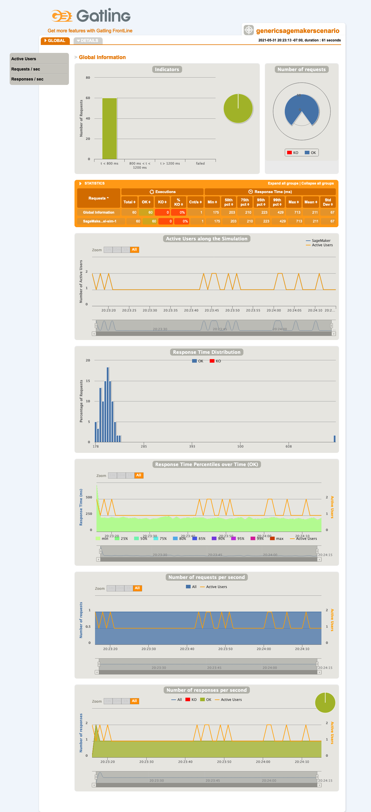
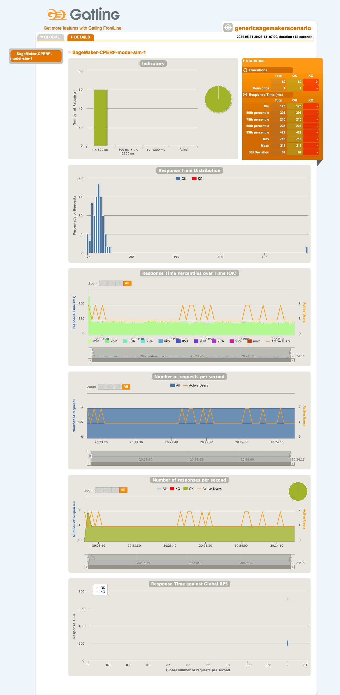

# sagemaker-gatling

[](https://github.com/intuit/sagemaker-gatling/actions/workflows/maven-build-push.yml)

`sagemaker-gatling` can run performance tests on your deployed AWS SageMaker endpoint. It can be run
as a jar file by itself, with configuration options for traffic level and durations. It can also be
included as a dependency in other projects, like
[perfsize-sagemaker](https://github.com/intuit/perfsize-sagemaker).

It is implemented with [Gatling](https://gatling.io/), which is an open source Scala-based
performance simulation tool with a [rich DSL](https://gatling.io/docs/current/cheat-sheet/) for
performance script coding. So you could also use this repo as an example starting point for
creating more customized Gatling scenarios for your needs.


## Usage

### Prerequisites

- Java JDK 1.8

### Execute fatjar

See details below for building and deploying the fatjar, but once it is available, you only need
Java to run it.

```sh
# Specify any needed config settings and results folder location:
java \
-Dauth.awsAccessKeyId=do-not-commit-to-git \
-Dauth.awsSecretAccessKey=do-not-commit-to-git \
-Dauth.awsSessionToken=do-not-commit-to-git \
-Dsagemaker.endpoint=CPERF-model-sim-1 \
-Dscenario.rampStartTps=0 \
-Dscenario.rampMinutes=0 \
-Dscenario.steadyStateTps=1 \
-Dscenario.steadyStateMinutes=1 \
-jar sagemaker-gatling-1.0-SNAPSHOT-fatjar.jar \
-s GenericSageMakerScenario \
-rf ./perfResults
```

See maven example below for sample output.


## Development

### Prerequisites

- Java JDK 1.8
- Maven

### Quick Start
```sh
git clone https://github.com/intuit/sagemaker-gatling.git

cd sagemaker-gatling

mvn clean package gatling:test -f pom.xml \
-Dgatling.simulationClass=GenericSageMakerScenario \
-Dauth.awsAccessKeyId=do-not-commit-to-git \
-Dauth.awsSecretAccessKey=do-not-commit-to-git \
-Dauth.awsSessionToken=do-not-commit-to-git \
-Dsagemaker.endpoint=CPERF-model-sim-1 \
-Dscenario.rampStartTps=0 \
-Dscenario.rampMinutes=0 \
-Dscenario.steadyStateTps=1 \
-Dscenario.steadyStateMinutes=1
```

See [application.conf](src/test/resources/application.conf) for more details on each option, and an
option for specifying request bodies.

### Sample Output
...
```
20:23:12.907 [INFO ] FileWeightDistribution - fileWeightJson: [
    {
      "path": "bodies/model-sim/1/status-200.input.json",
      "weight": 100
    }
  ]
20:23:12.941 [INFO ] FileWeightDistribution - fileWeightList: List(FileWeight(bodies/model-sim/1/status-200.input.json,100))
20:23:12.944 [INFO ] FileHelper$ - Unable to find file bodies/model-sim/1/status-200.input.json, so try finding as resource.
20:23:12.944 [INFO ] FileHelper$ - Found file as resource /bodies/model-sim/1/status-200.input.json
20:23:12.953 [INFO ] FileWeightDistribution - Verified file is accessible: bodies/model-sim/1/status-200.input.json
20:23:13.468 [INFO ] i.g.h.e.HttpEngine - Start warm up
20:23:14.532 [INFO ] i.g.h.e.HttpEngine - Couldn't execute warm up request https://gatling.io: i.g.h.c.i.RequestTimeoutException: Request timeout to gatling.io/34.77.242.251:443 after 1000 ms
20:23:14.534 [INFO ] i.g.h.e.HttpEngine - Warm up done
Simulation GenericSageMakerScenario started...
20:23:14.570 [INFO ] i.g.c.s.w.ConsoleDataWriter - Initializing
20:23:14.571 [INFO ] i.g.c.s.w.LogFileDataWriter - Initializing
20:23:14.578 [INFO ] i.g.c.s.w.ConsoleDataWriter - Initialized
20:23:14.583 [INFO ] i.g.c.s.w.LogFileDataWriter - Initialized

================================================================================
2021-05-31 20:23:19                                           5s elapsed
---- Requests ------------------------------------------------------------------
> Global                                                   (OK=4      KO=0     )
> SageMaker-CPERF-model-sim-1                              (OK=4      KO=0     )

---- SageMaker -----------------------------------------------------------------
[####                                                                      ]  6%
          waiting: 56     / active: 0      / done: 4     
================================================================================
```
...
```
================================================================================
2021-05-31 20:24:14                                          60s elapsed
---- Requests ------------------------------------------------------------------
> Global                                                   (OK=60     KO=0     )
> SageMaker-CPERF-model-sim-1                              (OK=60     KO=0     )

---- SageMaker -----------------------------------------------------------------
[##########################################################################]100%
          waiting: 0      / active: 0      / done: 60    
================================================================================

20:24:14.824 [INFO ] i.g.c.c.Controller - StatsEngineStopped
Simulation GenericSageMakerScenario completed in 60 seconds
Parsing log file(s)...
```
...
```
Parsing log file(s) done
Generating reports...

================================================================================
---- Global Information --------------------------------------------------------
> request count                                         60 (OK=60     KO=0     )
> min response time                                    175 (OK=175    KO=-     )
> max response time                                    713 (OK=713    KO=-     )
> mean response time                                   211 (OK=211    KO=-     )
> std deviation                                         67 (OK=67     KO=-     )
> response time 50th percentile                        203 (OK=203    KO=-     )
> response time 75th percentile                        210 (OK=210    KO=-     )
> response time 95th percentile                        223 (OK=223    KO=-     )
> response time 99th percentile                        429 (OK=429    KO=-     )
> mean requests/sec                                      1 (OK=1      KO=-     )
---- Response Time Distribution ------------------------------------------------
> t < 800 ms                                            60 (100%)
> 800 ms < t < 1200 ms                                   0 (  0%)
> t > 1200 ms                                            0 (  0%)
> failed                                                 0 (  0%)
================================================================================

Reports generated in 0s.
Please open the following file: sagemaker-gatling/target/gatling/genericsagemakerscenario-20210601032313163/index.html
[INFO] ------------------------------------------------------------------------
[INFO] BUILD SUCCESS
[INFO] ------------------------------------------------------------------------
[INFO] Total time:  01:39 min
[INFO] Finished at: 2021-05-31T20:24:15-07:00
[INFO] ------------------------------------------------------------------------

Process finished with exit code 0
```

### Sample Gatling Report

#### Global Information

The top level index.html file summarizes statistics across all request types (may be more useful
in cases where there is a mix of request types).



#### Details

Clicking on the Details tab shows statistics by request type.



### IDE setup

Any IDE should be fine.

For IntelliJ IDEA Community Edition:

- File > New > Project From Existing Sources...
- Navigate to this project directory.
- Select Maven and JDK 1.8 runtimes in the setup wizard.
- Project should compile and be ready to debug.

### Build

```sh
mvn package
```

The build process creates 3 files:
- sagemaker-gatling-1.0-SNAPSHOT.jar
- sagemaker-gatling-1.0-SNAPSHOT-shaded.jar
- sagemaker-gatling-1.0-SNAPSHOT-fatjar.jar

The first jar file contains just the compiled artifacts from this project.

The -shaded.jar contains additional classes embedded to make it usable by Frontline, which is an
optional service you can also use to run these tests.

The -fatjar.jar is even bigger and has all necessary dependencies included.  You can run this file
by itself with just Java (no need for resolving Maven dependencies).
[perfsize-sagemaker](https://github.com/intuit/perfsize-sagemaker)
uses a fatjar like this one for sending traffic loads.

### Deploy fatjar

See Release process below.


## Release

Update the version in [pom.xml](pom.xml) as needed (RELEASE vs SNAPSHOT build).

Create a new GitHub Release with a tag version as `v#.#` to correspond to the RELEASE version,
or `v#.#-SNAPSHOT-timestamp` for a unique SNAPSHOT tag.

GitHub Action [maven-build-push.yml](.github/workflows/maven-build-push.yml) will then package
the build artifacts and deploy them to the GitHub Packages Maven repository.  TODO: In the future,
will also deploy to the Maven Central repository.


## Contributing

Feel free to open an
[issue](https://github.com/intuit/sagemaker-gatling/issues)
or
[pull request](https://github.com/intuit/sagemaker-gatling/pulls)!

Make sure to read our [code of conduct](CODE_OF_CONDUCT.md).


## License

This project is licensed under the terms of the [Apache License 2.0](LICENSE).
